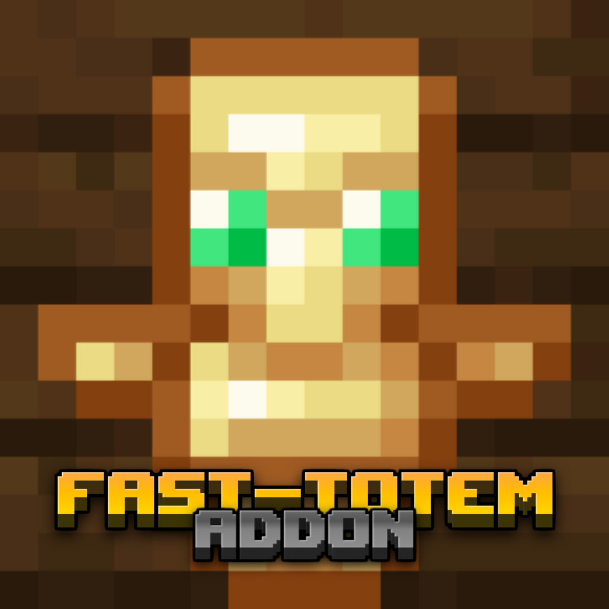
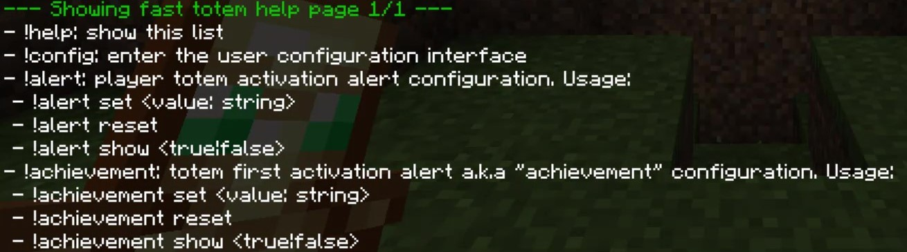
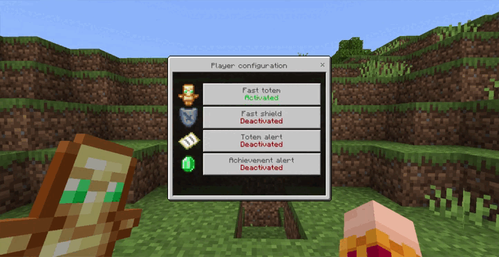

  
  <h1 align="center">Fast Totem v3</h1>
 
 ¡Equipa un nuevo tótem de inmortalidad o escudo sin abrir el inventario para sobrevivir unos segundos más en tu mundo! Solo necesitas hacer clic derecho o mantener presionada la pantalla y soltarla con el tótem o escudo equipado en tu mano principal.

¡Este complemento ofrece una forma conveniente de usar tótems y escudos! Con solo un simple clic o toque, puedes cambiarlos instantáneamente de tu mano principal a tu mano secundaria sin abrir el inventario. Esta característica, que se asemeja a la opción de la tecla "F" en la edición Java del juego, te permite acceder a tu tótem y escudo más rápido durante los momentos críticos. Este complemento también es totalmente compatible con otros complementos basados ​​en archivos player.json, para que puedas disfrutarlo con tus addons favoritos. Además, solo requiere que los experimentos de API Beta estén habilitados para funcionar, por lo que puedes comenzar a usarlo de inmediato. Ya sea que estés luchando en una raid, explorando ancient cities o teniendo una partida amistosa PvP con tus amigos, este complemento mejorará tu experiencia de juego y te dará una ventaja.

<h2 align="center">Caracteristicas adicionales</h2>

Fast totem addon incluye características adicionales útiles como el escudo rapido o fast shield, alertas que se mostrarán cuando un jugador active un tótem y un menú de configuración. Estas características se enlistarán a continuación

<ul>
<li><h3>Escudo rápido</h3>¡Mueve tu escudo a tu mano izquierda más rápido que nunca! No importa qué objeto tengas a mano, se intercambiarán. Puedes activar/desactivar esta función con el menú de comando !config
 </li>
<li><h3>Alerta de tótem</h3>Puedes activar una alerta que se mostrará cada vez que un jugador use un tótem, puedes activarla/desactivarla globalmente o cambiar el mensaje con el comando !alert o activarla/desactivarla localmente con el menú del comando !config
 </li>
<li><h3>Alerta de primer tótem o logro</h3>Puedes activar una alerta que se mostrará la primera vez que un jugador use un tótem, puedes activarla/desactivarla globalmente o cambiar el mensaje con el comando !achievement o activarla/desactivarla localmente con el menú del comando !config
 </li>
<li><h3>Comandos custom (alert, achievement, config, help)</h3>
  El addon incluye comandos personalizados, los cuales son: 
- !help: muestra la lista completa de comandos que proporciona el uso de cada comando 
- !config: ingresa a la interfaz de configuración del usuario 
- !alert: configura los ajustes de alerta de activación del tótem, este comando tiene 3 parámetros: 
  <ul><li>
  - set: te permite cambiar el mensaje de alerta, cada "{player}" escrito en el mensaje será reemplazado por el nombre del jugador que activó el tótem 
  - reset: restablece el mensaje de alerta al valor predeterminado 
  - show: le permite elegir si mostrar o no el mensaje de alerta
  </li></ul>
- !achievement: configuración de la primera alerta de activación del tótem (o logro), este comando tiene 3 parámetros: 
  <ul><li>
  - set: te permite cambiar el mensaje de alerta, cada "{player}" escrito en el mensaje será reemplazado por el nombre del jugador que activó el tótem 
  - reset: restablece el mensaje de alerta al valor predeterminado 
  - show: le permite elegir si mostrar o no el mensaje de alerta
  </li></ul>
  
NOTA IMPORTANTE: Es necesario tener el tag "TS:Admin" para poder editar las alertas. Puedes agregarlo usando /tag @s add "TS:Admin"
 
<li><h3>Menú de configuración</h3>Te permite activar/desactivar el tótem rápido, el escudo rápido y los mensajes de alerta. La configuración local del jugador siempre estará por encima de la configuración global.

</li></ul>

<h2 align="center"> Juegos experimentales </h2>

 Este add-on solo requiere de un juego experimental para funcionar correctamente: Beta APIs (Anteriormente conocido como Gametest Framework)

  

