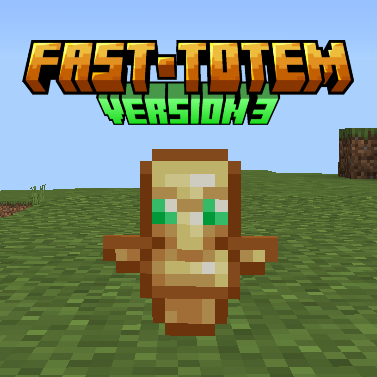

  
  <h1 align="center">Fast Totem v3</h1>
 
 Con este addon, coloca un totem rapidamente en tu segunda mano utilizando click derecho en caso de PC o manteniendo presionado (en caso de telefonos) o presionando interacción en caso de consolas.

 

<h2 align="center">Caracteristicas adicionales</h2>

Fast totem addon incluye características adicionales útiles como el escudo rapido o fast shield, alertas que se mostrarán cuando un jugador active un tótem y un menú de configuración. Estas características se enlistarán a continuación

<ul>
<li><h3>Escudo rápido</h3>Permite mover rápidamente a tu mano secundaria el escudo con solo click derecho, no importa si ya tienes un item en tu segunda mano, este se intercambiará con el totem de tu mano principal
 </li>
<li><h3>Alerta de tótem</h3>Un mensaje que saldrá en el chat cada vez que un jugador active un totem, esta se puede configurar usando el comando !alert, tambien se puede desactivar usando el menú de !config
 </li>
<li><h3>Alerta de primer tótem o logro</h3>Un mensaje que saldrá en el chat la primera vez que un jugador active un totem, esta se puede configurar usando el comando !achievement, también se puede desactivar usando el menú de !config
 </li>
<li><h3>Comandos custom (alert, achievement, config, help)</h3>
  El addon incluye comandos personalizados, los cuales son: 
- !help: muestra la lista completa de comandos que proporciona el uso de cada comando 
- !config: ingresa a la interfaz de configuración del usuario 
- !alert: configura los ajustes de alerta de activación del tótem, este comando tiene 3 parámetros: 
  - set: te permite cambiar el mensaje de alerta, cada "{player}" escrito en el mensaje será reemplazado por el nombre del jugador que activó el tótem 
  - reset: restablece el mensaje de alerta al valor predeterminado 
  - show: le permite elegir si mostrar o no el mensaje de alerta 
- !achievement: configuración de la primera alerta de activación del tótem (o logro), este comando tiene 3 parámetros: 
  - set: te permite cambiar el mensaje de alerta, cada "{player}" escrito en el mensaje será reemplazado por el nombre del jugador que activó el tótem 
  - reset: restablece el mensaje de alerta al valor predeterminado 
  - show: le permite elegir si mostrar o no el mensaje de alerta 
NOTA IMPORTANTE: Es necesario tener el tag "TS:Admin" para poder editar las alertas. Puedes agregarlo usando /tag @s add "TS:Admin"
 
</ul>

<h2 align="center"> Juegos experimentales </h2>

 Este add-on solo requiere de un juego experimental para funcionar correctamente: Beta APIs (Anteriormente conocido como Gametest Framework)

  

